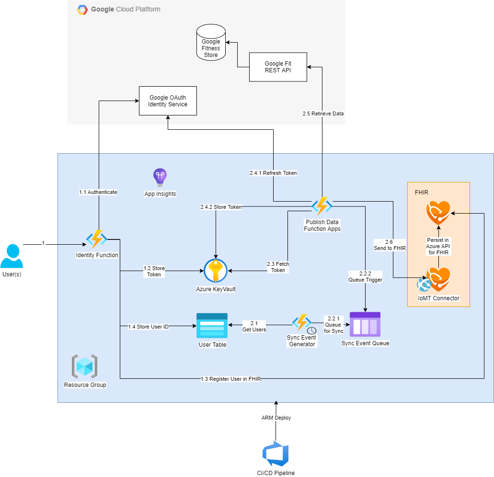

# Google Fit on FHIR

## Introduction

TODO: Expand introduction with a little more detail/context

This repo is available to help you get started with bringing Google FIT to FHIR. The webapp will help to authenticate your patients with the Google FIT API and the Azure Function that continously publishes patient data as it becomes available.

## Architecture

### Architecture Diagram
The following is a visual representation of the architecture that gets deployed through this solution:

### Resource List

TODO: Insert links to Microsoft docs where applicable

The following resources are deployed by the Bicep/ARM templates contained in the `deploy/` directory:

#### Function Apps

Note: More detail on the following functions can be found in the /src directory README [here](./src/README.md).

* Identity Function: Authenticates users and authorizes data sync to FHIR
* Sync Event Function: Periodically runs and retrieves user ID's for data to sync
* Publish Data Function: Pulls data from Google Fit and syncs/publishes it to FHIR server

#### Key Vaults

* Users Key Vault: Stores refresh tokens for users who have authenticated to the Google Fit API via the web app
* Infrastructure Key Vault: Stores secrets and connection strings needed for infrastructure deployment
    * Key Vault Secret: Queue Connection String for connecting the PublishData function to the queue

#### Storage Resources

* Storage Account: Contains the following sub-resources that enable data sync with FHIR
    * Blob Service: (TODO: What is this used for?)
    * Queue Service: Contains the Sync Event queue
        * Queue: Receives messages from the Sync Event Generator function.  Each messsage contains a userId for data that needs to be retrieved from Google Fit and pushed to FHIR
    * Table Service: Contains the User Table
        * Table: Stores a list of user ID's for users that have authenticated to Google Fit and authorized their data to be synced to FHIR server

#### FHIR Server

* Azure FHIR Service: (TODO: Description)
    * Azure FHIR IoMT connector: (TODO: Description)

#### Monitoring

* App Insights: Collects service logs and metrics from the Azure Functions (Note: Only performance and diagnostic data is collected.  No PII/PHI is logged in the solution implemented in this repo)
* Log Analytics Workspace: Receives service logs and metrics from App Insights

## Infrastructure Deployment

For prerequisites and instructions on deploying the Fit to FHIR infrastructure outlined above, [see here](./deploy/README.md).

### Run the App

For more information on the functions in this solution, and how to run and test the app, [see here](./src/README.md).

## FAQ and Troubleshooting

TODO

## Contributing

This project welcomes contributions and suggestions.  Most contributions require you to agree to a Contributor License Agreement (CLA) declaring that you have the right to, and actually do, grant us the rights to use your contribution. For details, visit [https://cla.opensource.microsoft.com](https://cla.opensource.microsoft.com).

When you submit a pull request, a CLA bot will automatically determine whether you need to provide a CLA and decorate the PR appropriately (e.g., status check, comment). Simply follow the instructions provided by the bot. You will only need to do this once across all repos using our CLA.

This project has adopted the [Microsoft Open Source Code of Conduct](https://opensource.microsoft.com/codeofconduct/). For more information see the [Code of Conduct FAQ](https://opensource.microsoft.com/codeofconduct/faq/) or contact [opencode@microsoft.com](mailto:opencode@microsoft.com) with any additional questions or comments.

## Trademarks

This project may contain trademarks or logos for projects, products, or services. Authorized use of Microsoft trademarks or logos is subject to and must follow [Microsoft's Trademark & Brand Guidelines](https://www.microsoft.com/en-us/legal/intellectualproperty/trademarks/usage/general).

Use of Microsoft trademarks or logos in modified versions of this project must not cause confusion or imply Microsoft sponsorship. Any use of third-party trademarks or logos are subject to those third-party's policies.
