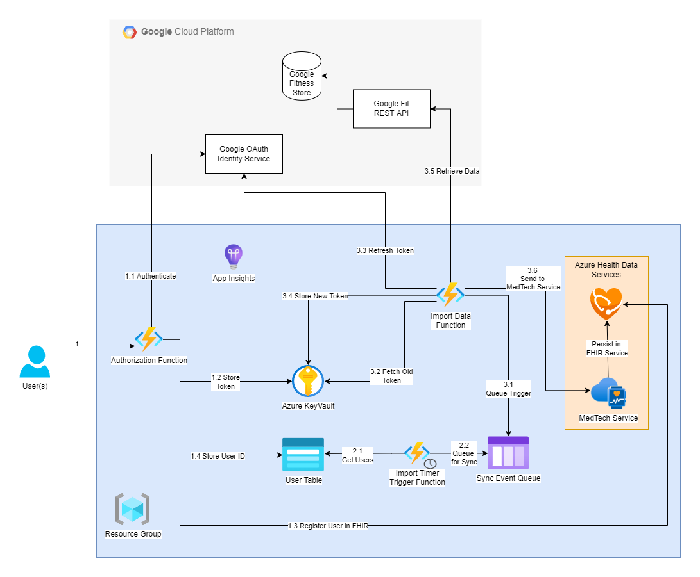

# Fit on FHIR

## Introduction

This project provides a simple way to import Google Fit data to the Azure Healthcare APIs FHIR Service. There are 3 Azure Functions deployed that handle scenarios required to sync Google Fit Data.

* **Authorization Function** - Provides a public endpoint that can be called by users to authorize sharing Google Fit data with your instance of Fit on FHIR.
* **Import Timer Trigger Function** - A timer that runs on a regular cadence and initiates the process of importing user data.
* **Import Data Function** - Reads data from the Google Fit API and writes it to the MedTech Service for persistence in FHIR.

## Quick Start

To jump ahead and deploy a working solution, you can follow our quick start guide [here](docs/quick-start.md).

## Architecture Diagram

The following is a visual representation of the architecture that gets deployed through this solution:

1. Authorization (initiated by a user)
    * 1.1 The Authorization Function directs the user to the Google OAuth service to login and authorize the Fit on FHIR application to access user data.
    * 1.2 The Authorization Function saves an access token and refresh token securely in Key Vault.
    * 1.3 A Patient Resource is created in FHIR for the on boarded user (this step is skipped if the user has previously on boarded).
    * 1.4 Metadata about the user and platform information is stored in the Users Table.
2. Import Timer Triggered (configured to run at a specified cadence)
    * 2.1 Users Table is queried and the user metadata is evaluated to determine if an import should be performed.
    * 2.2 If an import should be performed, an import message is added to the Sync Event Queue.
3. Import Data Triggered (runs when there are 1 or more import messages in the queue)
    * 3.1 The import message is evaluated to ensure an import should be performed.
    * 3.2 The refresh token is retrieved from Key Vault.
    * 3.3 A new access token (and refresh token) is retrieved from the Google Oauth Service.
    * 3.4 The new refresh token is stored securely in Key Vault.
    * 3.5 The access token is used to retrieve user data from the Google Fit REST API.
    * 3.6 Data is sent to the MedTech Service through an Event Hub, eventually persisted in FHIR as an Observation.  

## Contributing

This project welcomes contributions and suggestions.  Most contributions require you to agree to a Contributor License Agreement (CLA) declaring that you have the right to, and actually do, grant us the rights to use your contribution. For details, visit [https://cla.opensource.microsoft.com](https://cla.opensource.microsoft.com).

When you submit a pull request, a CLA bot will automatically determine whether you need to provide a CLA and decorate the PR appropriately (e.g., status check, comment). Simply follow the instructions provided by the bot. You will only need to do this once across all repos using our CLA.

This project has adopted the [Microsoft Open Source Code of Conduct](https://opensource.microsoft.com/codeofconduct/). For more information see the [Code of Conduct FAQ](https://opensource.microsoft.com/codeofconduct/faq/) or contact [opencode@microsoft.com](mailto:opencode@microsoft.com) with any additional questions or comments.

## Trademarks

This project may contain trademarks or logos for projects, products, or services. Authorized use of Microsoft trademarks or logos is subject to and must follow [Microsoft's Trademark & Brand Guidelines](https://www.microsoft.com/en-us/legal/intellectualproperty/trademarks/usage/general).

Use of Microsoft trademarks or logos in modified versions of this project must not cause confusion or imply Microsoft sponsorship. Any use of third-party trademarks or logos are subject to those third-party's policies.
