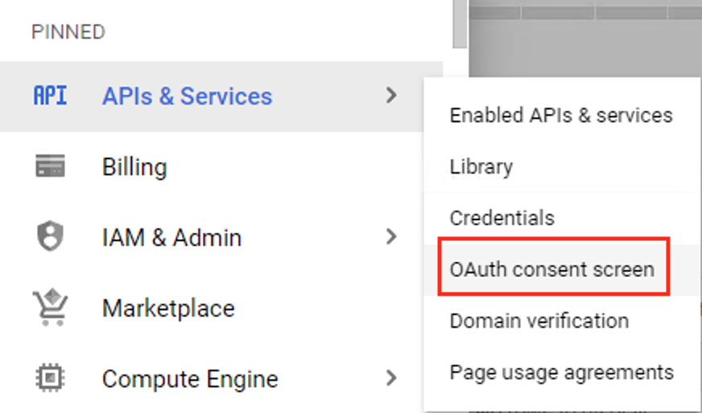
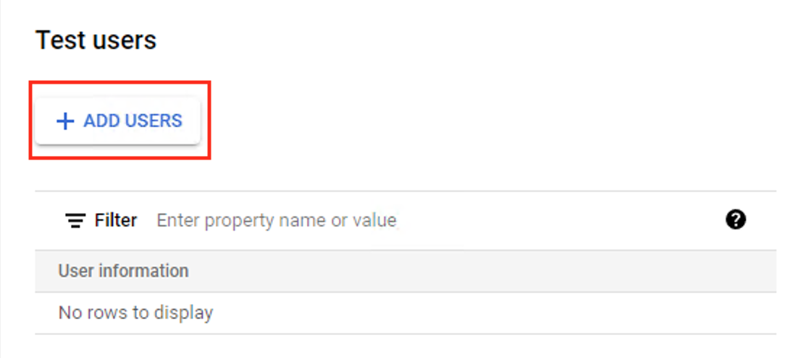

# Adding new test users

Before your solution can be made available to the general public, it will need to be verified by Google. Before verification, your solution will still function, however, it will be limited to a specific set of "Test Users" that must be added to the Test users section of the OAuth consent screen in your Google Cloud Platform Dashboard.

Navigate to the OAuth consent screen [here](https://console.cloud.google.com/apis/credentials/consent), or from the left menu on the Google Cloud Platform Dashboard, navigate to *OAuth consent screen* from under the *APIs & Services* menu on the left side pane.

Scroll to the Test users section and click the Add users button to add test users.

**It's important to note that there is a limit of 100 test users that can be added to a project.**
