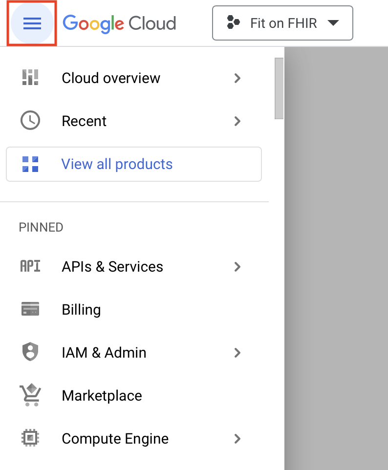
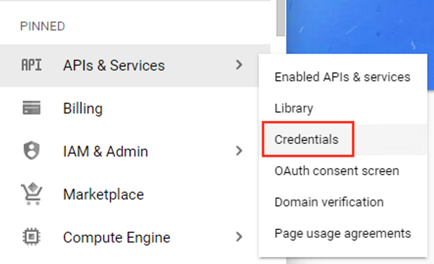
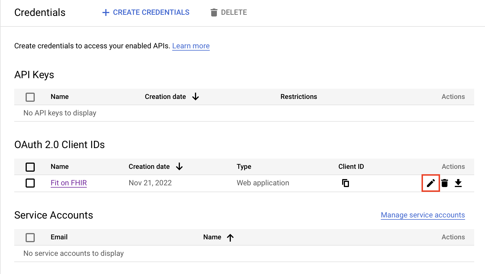
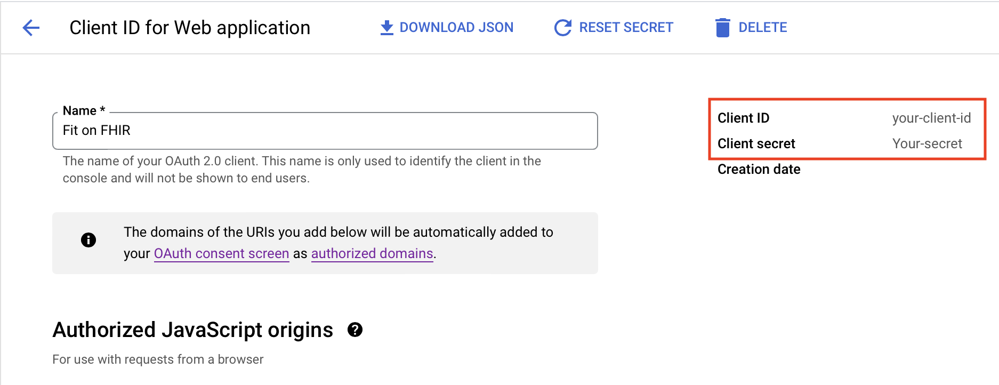

# Locating your Google Client Id and Secret

After creating your project and OAuth credentials, you may need to find your Client Id and Secret to deploy the solution to Azure. These values are required so the Azure Functions can make authenticated requests to the Google APIs.

Navigate to the [Google Cloud Platform console](https://console.cloud.google.com/), and open the Navigation Menu.

Navigate to *Credentials* from under the *APIs & Services* menu on the left side pane.

Find your credential in the list of OAuth 2.0 Client IDs and click the edit button.

Your Client Id and secret will be listed on the right side of the screen.

