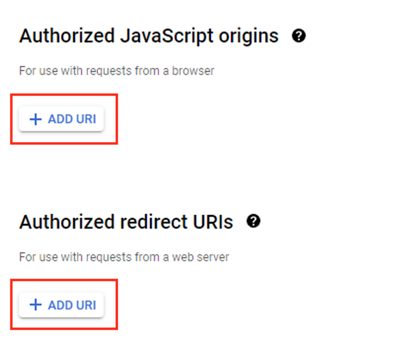

# Google Cloud Platform Setup

In order to test your deployment with the Google Fit API, it is necessary to setup a Google Cloud Platform account.
There are 5 areas of concern that must be addressed in order to complete this process.

## Create a Google Account

The first step is to create a google account. If you already have a google account that you would like to use, you can skip this step. Otherwise, Go to the [accounts page](https://accounts.google.com/signup/v2), and follow the steps
for signing up.

## Create a project in the dashboard

Once your google account has been created, go to the [Google Cloud Platform console](https://console.cloud.google.com/).  From the Dashboard view, click
the *Select a Project* dropdown.

From the view that appears, click the *NEW PROJECT* button.  Give your project a name, and choose your location.

## Enable API access

Next you'll want to enable API access for your project.  From the Dashboard view, navigate to *Enabled APIs & services*
from under the *APIs & Services* menu on the left side pane.

Here you will see a pre-populated list of currently enabled
APIs for your project.  You will need to enable the *Fitness API* and *People API*.  To do this, click on the button near the top
of the view labeled **ENABLE API AND SERVICES**.

This will take you to a new page, where you can enter the API names in the search
box.  For each one, when you are on the page for the API, click the Enable button.

## Create OAuth credentials

With the APIs enabled, you will need to create your OAuth credentials in order to allow your app to authorize with Google.
From the Dashboard view, navigate to *Credentials* from under the *APIs & Services* menu on the left side pane.

Here you will see a list of any current OAuth 2.0 clients.  You will need to create a new one for your project.  To do this, click on the button near the top of the view labeled **CREATE CREDENTIALS**.

This will present you with a drop down list.  Choose **OAuth client ID**.

This will take you to a new page, where you must choose the application type for this client ID.  Select **Web application**.  Before exiting this page, see the
next step below.

**Note -** The first time you create an OAuth client ID, you will be redirected to configure your OAuth concent screen. the only required data are:

* App name
* User support email
* Developer contact information

 While these are the only data required, it would be useful to also provide a list of test users that are allowed access to your app. You can also update the list of test users later in the **OAuth consent screen** in the left side pane.

## Add Authorized redirect URLs

Lastly, you need configure callback URI for your project.  Click the button labeled **Add URI** under *Authorized redirect URIs* to add the callback URI. The format of the URI will be **[https://authorize-{YOUR_BASE_NAME}.azurewebsites.net/api/googlefit/callback]()**.

**Note -** You may want to add this value after you have deployed the solution to Azure. *Authorized redirect URIs* are based off of the Authorization Function app URL and won't be available until after it is deployed.
