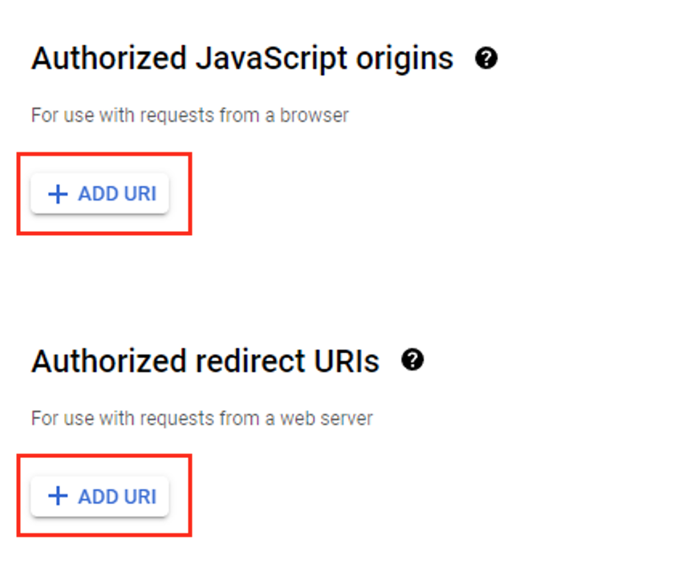

# Setting Authorized JavaScript origins and Authorized redirect URIs

In order for the **Authorization Function** to function properly, a callback URI must be configured in your Google OAuth Credential.

Navigate to the [Google Cloud Platform console](https://console.cloud.google.com/), and open the Navigation Menu.

Navigate to *Credentials* from under the *APIs & Services* menu on the left side pane.

Find your credential in the list of OAuth 2.0 Client IDs and click the edit button.

Click the button labeled **Add URI** under *Authorized redirect URIs* to add the callback URI. The format of the URI will be **[https://authorize-{YOUR_BASE_NAME}.azurewebsites.net/api/googlefit/callback]()**.

