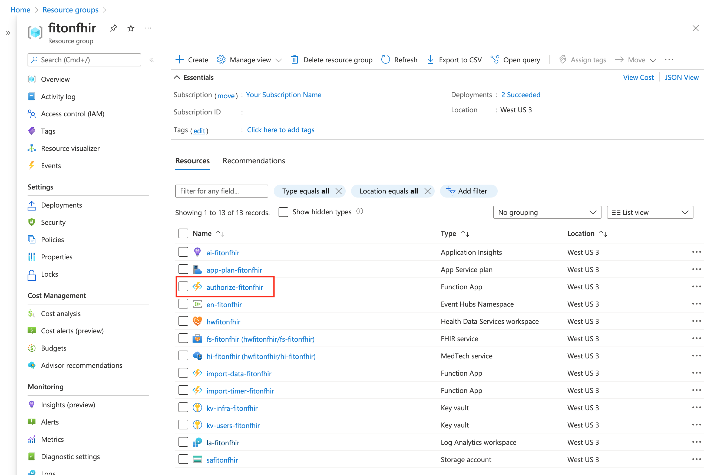
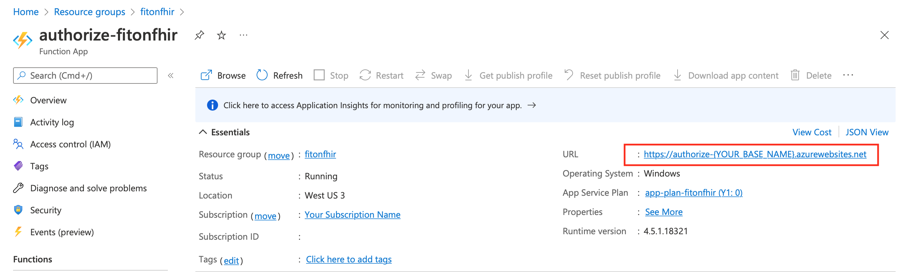
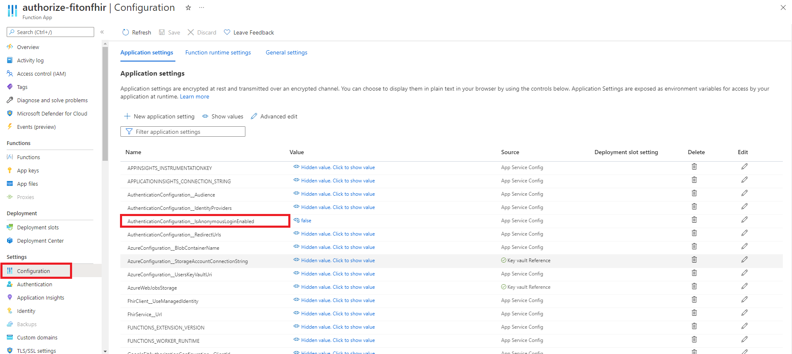
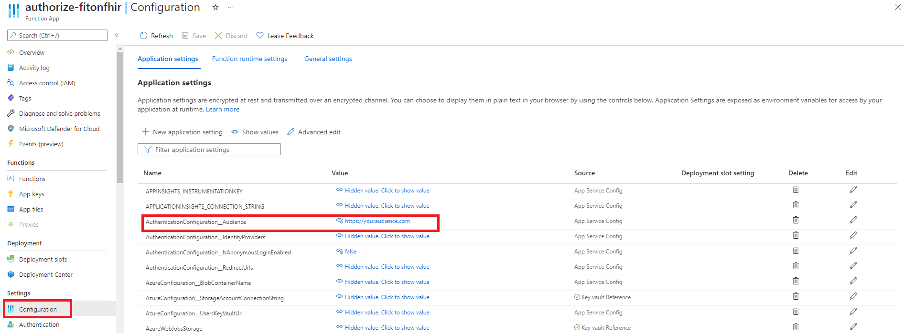
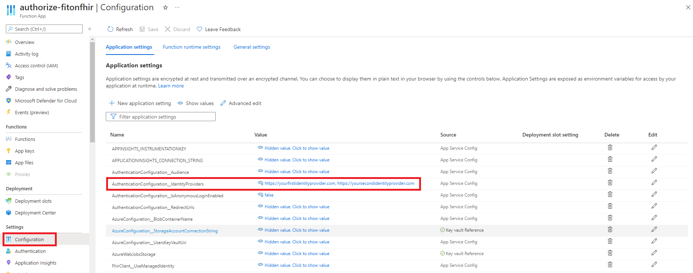
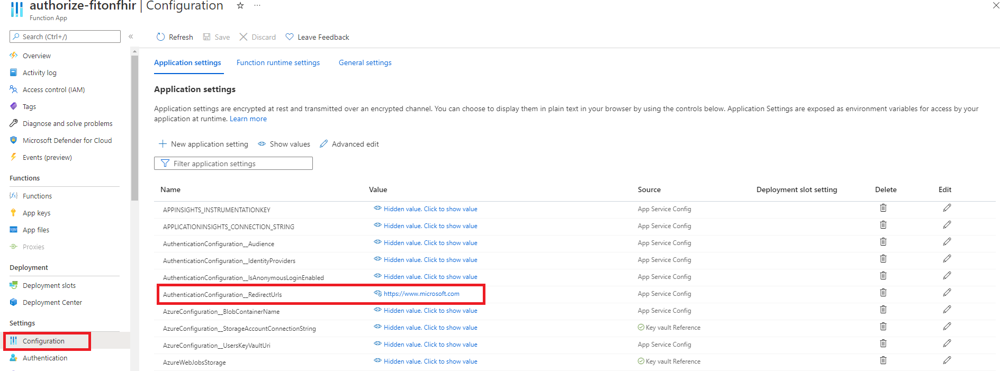

# Using Fit on FHIR

Congratulations. You have deployed Fit on FHIR to your Azure subscription and are ready to start collecting Google Fit Data. The first thing to do is have users on-board by authorizing sharing fitness data.

## User Authorization Endpoint

When users navigate to the authorize endpoint, they are redirected to a Google sign-in page where they can enter their credentials and opt-in to sharing data with your Fit on FHIR instance. After they complete the authorization process, Fit on FHIR will continuously import the fitness data they opted to share. By default, data imports occur once per hour.

Your authorization endpoint is hosted by the Authorization Function. The endpoint to begin the authorization flow can be determined by viewing the Function overview page, finding the Function base URL and appending **api/googlefit/authorize** to the base.

## Authorization Function Response Data

To allow for users to be redirected to a Google sign-in page, the Authorization function returns a JSON object that contains two values:

1. **AuthUrl** - This is the URL that should be used to navigate the user to the sign-in page.
1. **ExpiresAt** - This is a timestamp that indicates when authorized access will expire, for the user that is trying to complete the authorization process.

## Finding your Authorization Function Base URL

In your resource group, find the Authorization Function. It will be named **authorize-{YOUR_BASE_NAME}**, where, YOUR_BASE_NAME is the basename parameter provided when the resources were deployed.


In the overview section of the Function copy the base URL. Append the base URL with **api/googlefit/authorize**.


## Configuring Access to your Authorization Function

Access to the Authorization function can be configured to either allow for anonymous login, or login with authentication.  This setting is configured by setting
*AuthenticationConfiguration__IsAnonymousLoginEnabled* to true for anonymous logins, and false for login with authentication.  This can be found in can be found in the Settings for the Authorization function


It can also be set here in the azuredeploy.parameters.json file, by changing the defaultValue between false and true

```sh
"authentication_anonymous_login_enabled": {
      "type": "bool",
      "defaultValue": false,
      "metadata": {
        "description": "Enables anonymous logins (true) or requires authentication (false)."
      }
    }
```

When login with authentication is enabled, other settings must be set appropriately.  The *AuthenticationConfiguration__Audience* must be declared, which is used to match against the *aud* claim in the OAuth2 access token passed along in the request to your endpoint.
It can be found here


It can also be set here in the azuredeploy.parameters.json file

```sh
"authentication_audience": {
      "type": "string",
      "defaultValue": "",
      "metadata": {
        "description": "The URL that any access tokens are granted for."
      }
    }
```

In addition to the *AuthenticationConfiguration__Audience* setting, the *AuthenticationConfiguration__IdentityProviders* must also be set appropriately.  The *AuthenticationConfiguration__IdentityProviders* is used to match against the *iss* claim in the OAuth2 access token passed along in the request to your endpoint.
This can be a list of URLs, with each entry separated by a comma.  It can be found here


It can also be set here in the azuredeploy.parameters.json file

```sh
"authentication_identity_providers": {
      "type": "string",
      "defaultValue": "",
      "metadata": {
        "description": "A list of identity provider URLs used when authentication is required."
      }
    }
```

Lastly, for either anonymous or authenticated logins, *AuthenticationConfiguration__RedirectUrls* must be set.  This is a comma separated list of approved URLs that can be matched against in an authorize request.
When an authorize request is made with an approved redirect URL that matches an entry in this list, then when authorization is complete with Google, the browser will redirect to that site.
It can be found here


It can also be set here in the azuredeploy.parameters.json file

```sh
"authentication_redirect_urls": {
      "type": "string",
      "defaultValue": "",
      "metadata": {
        "description": "A comma delimited list of approved redirect URLs that can be navigated to when authentication completes successfully."
      }
    }
```

## Making Requests to your Authorization Function

Listed below are the required and optional query parameters that make up a request to your Authorization endpoint.

**Query Parameters**:

|Login Method|Query Parameter|Use|Required
|---|---|---|---
|Anonymous|external_id, external_system|Combined these are used to create a FHIR [Identifier](http://hl7.org/fhir/datatypes.html#Identifier) that is stored in the [Patient Resource](http://hl7.org/fhir/patient.html). This Identifier can be used to link the Patient Resource to a user (or patient) in a different system.|true
|Anonymous & Authenticated|redirect_url|the URL that the Authorization function will redirect to, once authorization with Google is complete.  The URL contained in *redirect_url* must match a URL that is on the approved list for the Authorization function.|true
|Anonymous & Authenticated|state|Can be used to enter any info that should be passed along in the request made to the *redirect-url* when authorization with Google is complete|false

**Anonymous logins**:

An example anonymous login request might look like: [https://authorize-YOUR_BASE_NAME.azurewebsites.net/api/googlefit/authorize?external_id=externalPatient&external_system=externalSystem&redirect_url=https://www.microsoft.com/](https://github.com/microsoft/fit-on-fhir/blob/main/docs/using-fit-on-fhir.md)

**Authenticated logins**:

An example authenticated login request might look like: [https://authorize-YOUR_BASE_NAME.azurewebsites.net/api/googlefit/authorize?redirect_url=https://www.microsoft.com/](https://github.com/microsoft/fit-on-fhir/blob/main/docs/using-fit-on-fhir.md) with the Bearer header set to a valid OAuth2 access token

**Optional State Query Parameter**:

An example authenticated login request with this optional parameter might look like: [https://authorize-YOUR_BASE_NAME.azurewebsites.net/api/googlefit/authorize?redirect_url=https://www.microsoft.com/&state=yourStateValue](https://github.com/microsoft/fit-on-fhir/blob/main/docs/using-fit-on-fhir.md)  again with the Bearer header set to a valid OAuth2 access token
